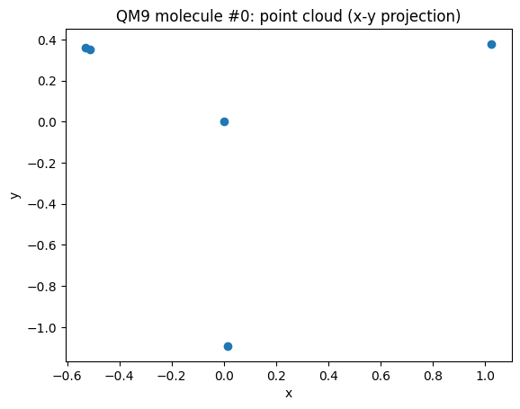
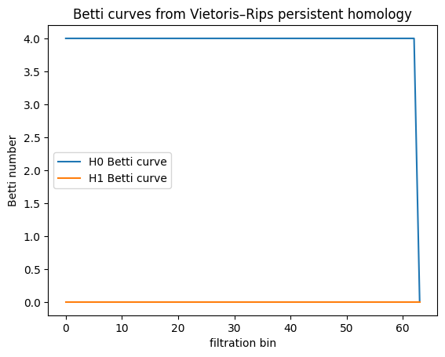
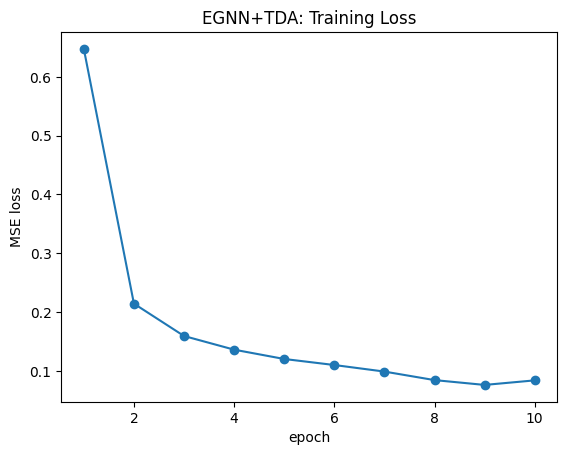
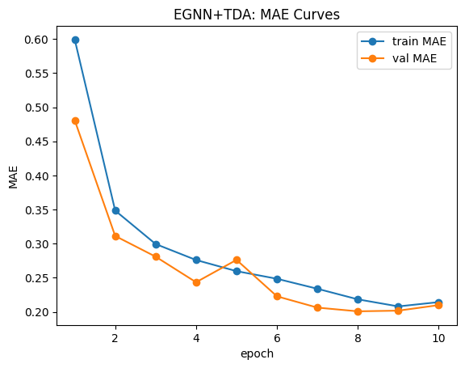
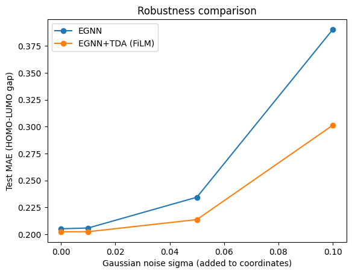

# Topology-Aware Equivariant Neural Networks for Molecular Property Prediction (HOMO-LUMO gap)

## Abstract
This project studies how **geometric deep learning** and **topological data analysis (TDA)** can be combined
to improve molecular property prediction. We focus on predicting the **HOMO–LUMO gap** on the QM9 dataset,
using an **E(n)-Equivariant Graph Neural Network (EGNN)** as a baseline and a **topology-aware EGNN**
augmented with **persistent homology features** fused via **FiLM conditioning**.

We show that incorporating topological priors:
1. Slightly improves predictive accuracy.
2. Significantly improves robustness to coordinate noise.

---

## 1. Motivation

Molecules are inherently **geometric objects**: atoms live in 3D space, and physical properties must be
**invariant** under rotations and translations. Standard neural networks do not encode these symmetries,
leading to inefficient learning.

Geometric Deep Learning addresses this by enforcing symmetry constraints directly in the model.
However, geometry alone does not fully capture **global structural properties** such as:
- rings,
- cycles,
- connectivity across scales.

These are naturally described by **Topology**.

This project explores whether **topological descriptors** extracted via persistent homology can complement
equivariant neural networks.

---

## 2. Mathematical Background

### 2.1 Euclidean Symmetry
The Euclidean group in 3D is:
\[
E(3) = \mathbb{R}^3 \rtimes SO(3)
\]

A valid molecular predictor must satisfy:
\[
f(\{x_i\}) = f(\{R x_i + t\})
\]

for all rotations \(R\) and translations \(t\).

---

### 2.2 Equivariance vs Invariance
- **Equivariance**: intermediate representations transform predictably.
- **Invariance**: final outputs remain unchanged.

EGNNs guarantee equivariance at each layer and invariance after pooling.

---

## 3. E(n)-Equivariant Graph Neural Networks (EGNN)

Each molecule is modeled as a fully-connected graph:
- nodes: atoms,
- edges: pairwise interactions.

At layer \(\ell\):
\[
m_{ij} = \phi_m(h_i, h_j, ||x_i - x_j||^2)
\]
\[
h_i^{\ell+1} = \phi_h(h_i, \sum_j m_{ij})
\]
\[
x_i^{\ell+1} = x_i + \sum_j (x_i - x_j) \phi_x(m_{ij})
\]

These updates preserve E(3)-equivariance.

A graph-level embedding is obtained by masked mean pooling.

---

## 4. Topological Data Analysis

### 4.1 Persistent Homology
Given atomic coordinates as a point cloud:
\[
X = \{x_1, \dots, x_N\} \subset \mathbb{R}^3
\]

We build a **Vietoris–Rips filtration** and track:
- \(H_0\): connected components,
- \(H_1\): loops (rings).

Each feature has a birth–death pair \((b, d)\).

---

### 4.2 Topological Features Used
We summarize persistence diagrams using:
- **Betti curves** (64 bins for each homology dimension),
- **Persistence entropy**.

Total TDA feature dimension: **130**.

---

## 5. Visual Evidence of TDA

### Molecular point cloud (example)


### Betti curves from persistent homology


---

## 6. Fusion Model: EGNN + TDA (FiLM)

Let:
- \(h \in \mathbb{R}^d\): EGNN graph embedding,
- \(t \in \mathbb{R}^{d_t}\): TDA vector.

FiLM conditioning:
\[
(\gamma, \beta) = \text{MLP}(t)
\]
\[
h' = (1 + \gamma) \odot h + \beta
\]

---

## 7. Dataset

**QM9** dataset (~130k molecules).  
Target: HOMO–LUMO gap.  
Metric: MAE.

---

## What is the HOMO–LUMO Gap?

The **HOMO–LUMO gap** is one of the most important quantum-chemical descriptors of a molecule.

It is defined as:

[
\Delta E = E_{\text{LUMO}} - E_{\text{HOMO}}
]

where:

* **HOMO**: Highest Occupied Molecular Orbital
* **LUMO**: Lowest Unoccupied Molecular Orbital

---

## Physical Interpretation

The HOMO–LUMO gap represents the **minimum energy required** to excite an electron from the highest occupied orbital to the lowest unoccupied one.

It is directly related to:

### 1. Chemical Reactivity

* Small gap → molecule is **more reactive**
* Large gap → molecule is **more stable**

Reason:

* Small gaps mean electrons can be excited easily.

---

### 2. Optical Properties

The gap determines:

[
E_{\text{photon}} \approx \Delta E
]

This controls:

* absorption wavelength,
* color of materials,
* fluorescence.

---

### 3. Electronic Properties

In materials science:

| Gap size   | Material type |
| ---------- | ------------- |
| Large gap  | Insulator     |
| Medium gap | Semiconductor |
| Small gap  | Conductor     |

Thus, predicting HOMO–LUMO gaps is crucial for:

* photovoltaics,
* OLEDs,
* molecular electronics,
* drug design.

---

## Why Is the HOMO–LUMO Gap Hard to Predict?

The HOMO–LUMO gap depends on:

* atomic composition,
* 3D geometry,
* electron delocalization,
* global connectivity patterns.

This means it is influenced by both:

### Local geometric structure

* bond lengths,
* bond angles,
* atomic neighborhoods.

### Global molecular topology

* rings,
* cycles,
* conjugated systems,
* connectivity across scales.

Traditional neural networks may struggle because:

* They do not respect physical symmetries.
* They may miss global topological patterns.

This motivates combining:

[
\textbf{Geometry (EGNN)} + \textbf{Topology (TDA)}
]

---

## Why TDA Helps for HOMO–LUMO Prediction

Topological features capture:

### Ring structures

Many organic molecules contain:

* aromatic rings,
* conjugated systems.

These strongly affect:

* electron delocalization,
* orbital energies,
* optical properties.

Persistent homology detects these as:

[
H_1 \text{ loops}
]

---

### Connectivity across scales

As the filtration radius increases:

* disconnected atoms merge,
* molecular structure emerges.

This gives a **multi-scale summary** of geometry.

Such summaries are:

* invariant to rotations,
* robust to noise,
* sensitive to global structure.

This complements the **local message passing** of EGNN.

---

## Interpretation of Results

### Accuracy

| Model    | Test MAE   |
| -------- | ---------- |
| EGNN     | 0.2051     |
| EGNN+TDA | **0.2023** |

The improvement is modest (~1.4%), which suggests:

* EGNN already captures most local geometric information.
* TDA provides **additional global structure signals**.

---

### Robustness

At noise level σ = 0.10:

| Model    | Test MAE   |
| -------- | ---------- |
| EGNN     | 0.3904     |
| EGNN+TDA | **0.3014** |

This is a **~23% reduction in error**.

This indicates:

* EGNN relies more on precise coordinates.
* TDA features are **stable under perturbations**.

This aligns with theoretical guarantees of persistent homology:

[
d_B(D(X), D(Y)) \leq ||X - Y||_\infty
]

Small geometric changes lead to small topological changes.

---

## Why the Improvement Is Moderate (Not Huge)

There are several reasons:

### 1. QM9 molecules are small

* Up to 9 heavy atoms.
* Limited topological complexity.

Many molecules:

* have no rings,
* have simple connectivity.

Thus, topology adds only a small signal.

---

### 2. EGNN is already strong

Equivariant networks:

* encode geometry correctly,
* are state-of-the-art for QM9 tasks.

So improvements are expected to be incremental.

---

### 3. Simple topological features

We used:

* Betti curves,
* persistence entropy.

More expressive approaches could include:

* element-aware filtrations,
* bond-weighted complexes,
* learnable topological layers.

---

## Main Research Conclusions

### 1. Geometry is necessary

Equivariant models capture:

* local interactions,
* physically meaningful representations.

---

### 2. Topology provides complementary global information

Persistent homology captures:

* ring structures,
* global connectivity.

---

### 3. Topology improves robustness

The fusion model:

* is less sensitive to coordinate noise,
* generalizes better under perturbations.

---

### 4. FiLM is an effective fusion mechanism

Instead of concatenating features:

[
h' = (1 + \gamma) \odot h + \beta
]

This allows topology to **modulate geometric representations**.

---

## Broader Implications

This work suggests a promising research direction:

### Topology-aware geometric learning

Potential applications:

* drug discovery,
* protein structure prediction,
* materials science,
* generative molecular design.

---

## Key Takeaway

The HOMO–LUMO gap depends on both:

[
\text{local geometry} + \text{global topology}
]

Combining EGNN with persistent homology:

* improves robustness,
* slightly improves accuracy,
* provides a physically meaningful inductive bias.


## 8. Training Dynamics




---

## 9. Results

| Model | Val MAE | Test MAE |
|------|--------|---------|
| EGNN | 0.2056 | 0.2051 |
| **EGNN + TDA (FiLM)** | **0.2009** | **0.2023** |

---

## Robustness to Noise



At noise level σ=0.10, TDA reduces error by ~23%.

---

## 10. Conclusion

Topology-aware equivariant models improve robustness and slightly improve accuracy.
This validates topology as a complementary inductive bias for molecular ML.

---

## Reproducibility

```bash
python -m src.train
python -m scripts.build_tda_cache
python -m src.train_fusion
python -m src.eval
```

---

## References
- Satorras et al., EGNN
- Hofer et al., TDA
- QM9 Dataset
