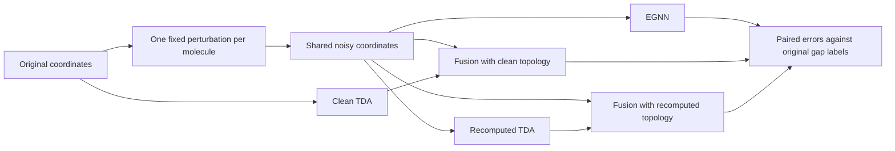
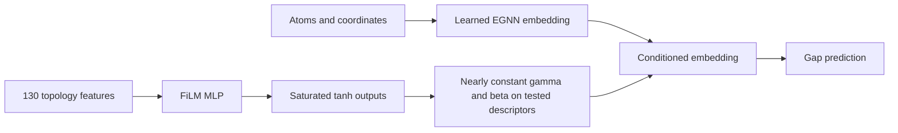

# EGNN with topology features on QM9

This project tests whether persistent-homology features help an EGNN predict the QM9 HOMO–LUMO gap. I built a training and evaluation pipeline around `egnn_pytorch`, then added a FiLM-conditioned model using Betti curves and persistence entropy.

**Current finding — 13 September 2026:** fusion has lower error under paired coordinate noise, but its topology conditioning is saturated. Swapping individual descriptors barely changes predictions. These results **do not establish a benefit from molecule-specific topology**.

[Research report](reports/paired_pilot_2026-09-13.md) · [Exact inputs and results](results/paired_pilot_2026-09-13) · [Next experiment](docs/controlled_replication.md)

**New training diagnostic:** standardizing TDA on training molecules prevented early FiLM saturation: **0% saturated outputs versus 85.7% with raw features** after one epoch. Both arms used identical initial weights and minibatch order. This restores descriptor sensitivity; it does not yet show a topology-specific prediction benefit. [Diagnostic report](reports/conditioning_diagnostic_2026-09-13.md).


## The result at a glance

The pilot used **256 frozen validation molecules**, recovered checkpoints and identical perturbations across all three arms. Targets remain the original molecular gaps.

| Coordinate noise | EGNN MAE | Fusion: clean topology | Fusion: recomputed topology |
| --- | ---: | ---: | ---: |
| 0 Å | 0.187738 eV | 0.200843 eV | 0.200843 eV |
| 0.10 Å | 0.380251 eV | 0.328248 eV | 0.328248 eV |


At 0.10 Å, fusion has **13.68% lower mean absolute error** in this pilot. The paired difference is −0.052003 eV, with a 95% molecule-bootstrap interval of [−0.103444, −0.003422] eV. Fusion wins on 139/256 molecules. This is one noise realization and one pair of checkpoints; the interval does **not** measure variation across training seeds.

## What the corrected comparison measures

The original noise comparison below used clean cached topology and independently drawn coordinate noise. It remains a historical asymmetric-input experiment; the corrected pilot uses the same perturbed coordinates in all three conditions.


```mermaid
flowchart LR
    X["Original coordinates"] --> N["One fixed perturbation per molecule"]
    N --> G["Shared noisy coordinates"]
    G --> E["EGNN"]
    G --> FC["Fusion with clean topology"]
    G --> FN["Fusion with recomputed topology"]
    X --> TC["Clean TDA"]
    TC --> FC
    G --> TN["Recomputed TDA"]
    TN --> FN
    E --> P["Paired errors against original gap labels"]
    FC --> P
    FN --> P
```

Perturbations are computed on real atoms only and saved with input/descriptor hashes. This tests input corruption, not recalculated quantum properties of distorted molecules.

## What we learned about conditioning

All 256 noisy descriptors changed, yet clean and noisy topology produced essentially identical fusion predictions. The activation and replacement checks explain why.


```mermaid
flowchart LR
    T["130 topology features"] --> M["FiLM MLP"]
    M --> S["Saturated tanh outputs"]
    S --> C["Nearly constant gamma and beta on tested descriptors"]
    Z["Atoms and coordinates"] --> H["Learned EGNN embedding"]
    H --> F["Conditioned embedding"]
    C --> F
    F --> R["Gap prediction"]
```

| Evidence | Interpretation |
| --- | --- |
| All checked FiLM outputs have absolute value above 0.9999 after tanh | Conditioning is near its saturation limits |
| Shuffling descriptors or using one real descriptor changes predictions by less than 1e-6 eV | Individual topology has negligible influence on this pilot |
| Zeroing descriptors causes large errors | This out-of-distribution intervention changes the operating point; it does not establish useful individual topology |

Constant FiLM coefficients can be absorbed into the regression head's first linear layer. The fusion checkpoint can therefore behave like a geometric predictor with different learned weights. These checks do not reveal whether TDA influenced training or when saturation developed. Unscaled feature magnitudes are a hypothesis to investigate, not an established cause.

Our conclusion is to **pause topology-specific performance claims** and diagnose conditioning before replication. A negative or inconclusive topology result is a valid research outcome.

## What was verified

- All four historical clean validation/test MAEs reproduce within **7.22e-9 eV**, across 26,167 molecules.
- All 256 selected original topology vectors match recomputation exactly; real-molecule symmetry and padding checks pass.
- Ten software tests cover pairing, cache compatibility, frozen splits, checkpoint loading, aggregation and training-only scaling.
- Exact inputs, predictions, hashes, activation checks and measured compute are [archived](results/paired_pilot_2026-09-13). Original outputs remain unchanged.

Full-test clean MAEs are **0.205111 eV for EGNN and 0.202298 eV for fusion**. Their paired molecule-bootstrap interval for the difference is [−0.005871, +0.000230] eV and crosses zero. Numerical reproduction does not establish a reliable topology advantage.

## Method

The baseline embeds atomic numbers, applies four EGNN layers and pools the node embeddings to predict the gap. The fusion model modulates the pooled representation with 130 features: 64 Betti bins for each of H0 and H1, plus two persistence entropies. Topology is computed from centered molecular coordinates scaled to unit diameter.

Both models use a random 80/10/10 split, seed 42, ten training epochs, batch size 64 and AdamW with learning rate 0.001. Checkpoints are selected by validation MAE. The [method notes](docs/methods.md) describe implementation details and unresolved descriptor/cache issues.

<details>
<summary>Historical asymmetric noise comparison</summary>

These values come from [compare_table.csv](results/compare_table.csv) and [compare_robustness.csv](results/compare_robustness.csv). MAE is in eV; noise sigma is in the original coordinate units.

| Input condition | EGNN test MAE | EGNN + TDA test MAE |
| --- | ---: | ---: |
| Clean coordinates and topology | 0.2051 | 0.2023 |
| Coordinate noise, sigma 0.01; fusion topology remains clean | 0.2058 | 0.2024 |
| Coordinate noise, sigma 0.05; fusion topology remains clean | 0.2344 | 0.2137 |
| Coordinate noise, sigma 0.10; fusion topology remains clean | 0.3904 | 0.3014 |

The [experiment record](reports/experiment_log.md) retains the separate baseline run, topology analysis and training history. The old noise plot in `figures/compare_robustness.png` visualizes this same asymmetric comparison, not a corrected robustness test.

</details>

## Reproduce and inspect

```bash
# Install an appropriate official PyTorch 2.10.0 CPU/CUDA wheel first.
python -m pip install -r requirements-validation.txt
python -m pytest -q
python -m src.eval_paired --help
```

Start with the [validation environment and commands](docs/paired_evaluation.md) or [Colab notebook](notebooks/paired_validation.ipynb). Dataset files, trained checkpoints and the full topology cache are outside Git; the archived pilot can be inspected immediately. Use new output locations to preserve earlier runs. The legacy training and `src.eval` entry points remain available, but the old evaluator does not implement the corrected paired protocol.

## Validation and next decision

The [paired protocol](docs/paired_evaluation.md), `src.eval_paired` and recovery
checks implement the diagnostic. The [validation audit](reports/validation_audit_2026-09-13.md)
records recovered artifacts, software checks and execution status.

The [archived pilot](results/paired_pilot_2026-09-13) includes per-molecule predictions, exact inputs, checksums, recovery checks and measured compute. Labels stay fixed: this tests input corruption, not the electronic properties of newly distorted molecules.

The follow-up one-epoch diagnostic trained two newly initialized fusion models on 4,096 training molecules using the local RTX 3080 Ti. Standardization passed the conditioning check. The next comparison uses independent training seeds on the fixed split, a trained constant-conditioning control and simple geometric descriptors. The Betti grids remain fitted separately for each molecule; a shared, training-defined grid would require rebuilding the cache and retraining.

The [next-step protocol](docs/controlled_replication.md) records the completed diagnostic and proposed controlled replication. Multi-seed replication has not run. Full historical clean metrics were reproduced, but the full-test paired molecule interval crosses zero; numerical reproduction alone does not establish a reliable advantage.

## Code and references

- [Data and topology](src/data), [models](src/models), [training](src/train.py), [fusion training](src/train_fusion.py), [evaluation](src/eval.py).
- [EGNN paper](https://arxiv.org/abs/2102.09844) and [egnn-pytorch implementation](https://github.com/lucidrains/egnn-pytorch).
- [PyG QM9 targets and units](https://pytorch-geometric.readthedocs.io/en/2.6.1/generated/torch_geometric.datasets.QM9.html) and [giotto-tda BettiCurve](https://giotto-ai.github.io/gtda-docs/latest/modules/generated/diagrams/representations/gtda.diagrams.BettiCurve.html).
