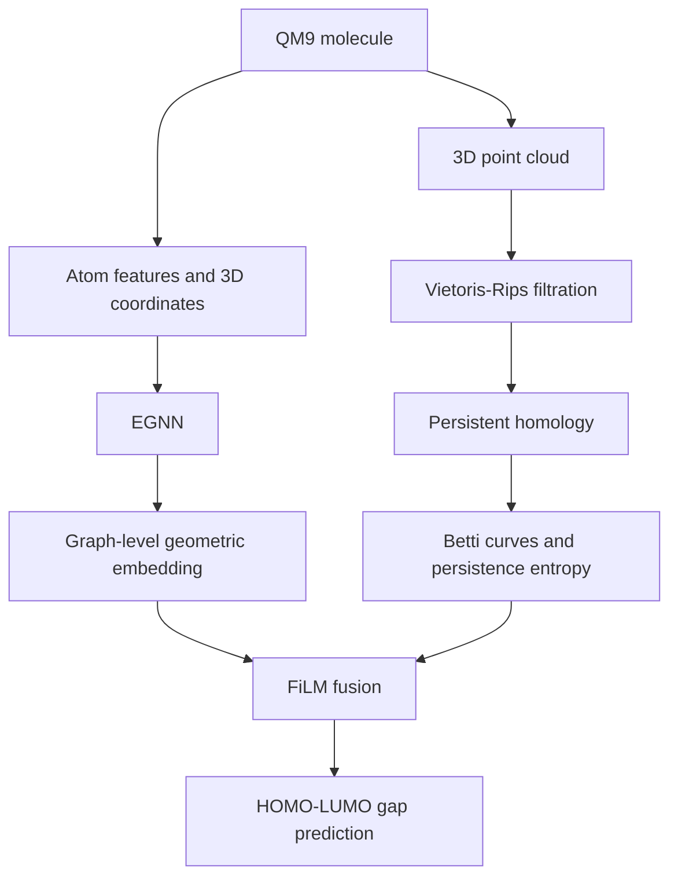
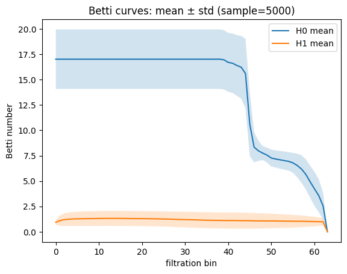
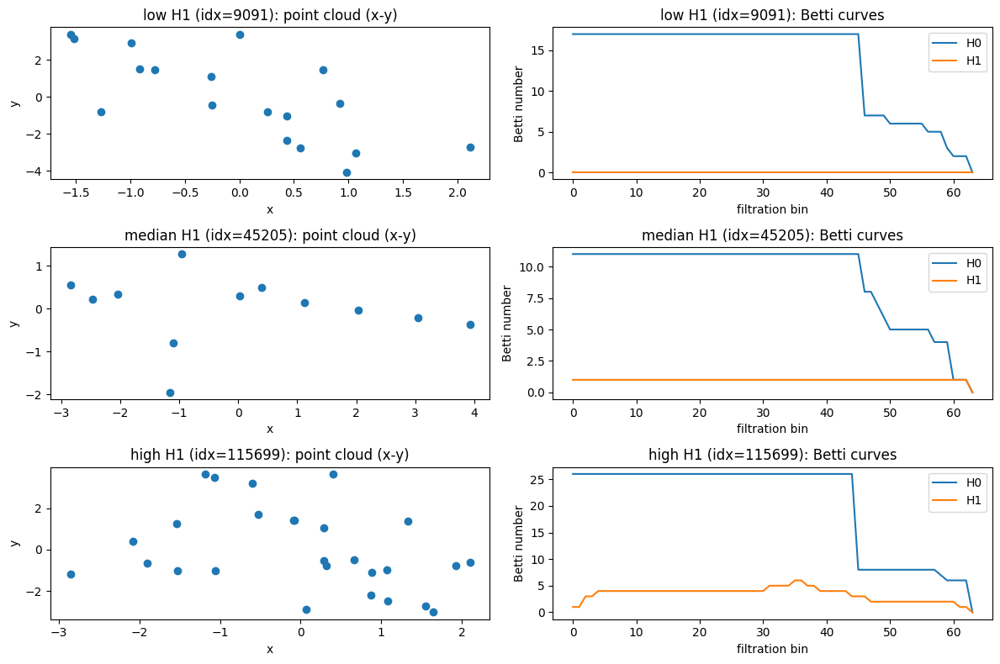
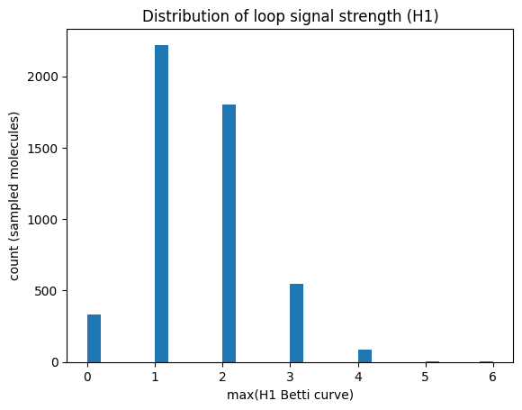
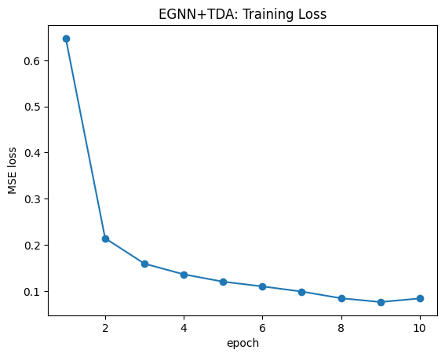
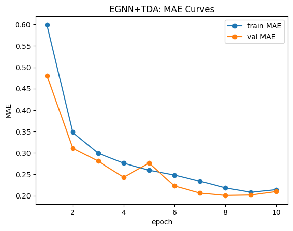
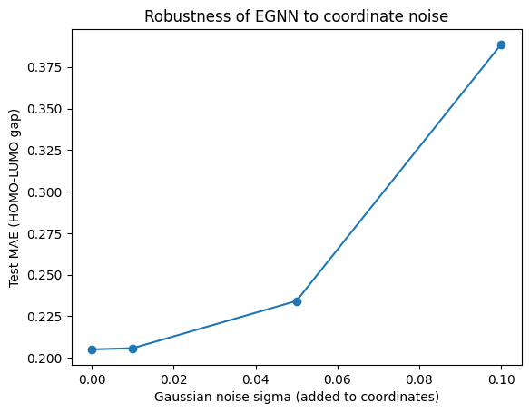
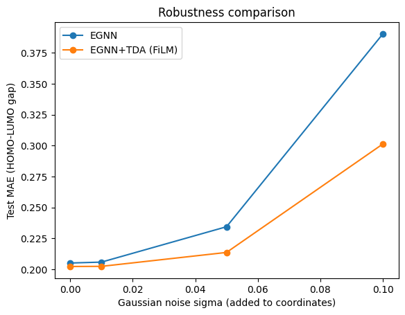

# Topology-Aware EGNN for HOMO–LUMO Gap Prediction on QM9

**TL;DR:** This project tests whether persistent homology features add useful global structural information to E(n)-Equivariant Graph Neural Networks for molecular property prediction. On QM9 HOMO–LUMO gap prediction, the standard accuracy improvement is modest, so the project should not be read as a major predictive improvement. The more interesting result is robustness: topology-aware FiLM conditioning reduces error under coordinate noise, suggesting that persistent homology can act as a noise-stable global descriptor.

## Highlights

* Implemented an EGNN baseline for QM9 HOMO–LUMO gap prediction.
* Extracted persistent homology features from molecular 3D point clouds.
* Fused geometric and topological representations using FiLM conditioning.
* Used 64 Betti bins, homology dimensions (H_0) and (H_1), and a 130-dimensional TDA feature vector.
* Found only a modest standard test MAE improvement: **0.2051 → 0.2023**.
* Observed a stronger robustness improvement under coordinate noise at (σ=0.10): **0.3904 → 0.3014**, approximately **22.8% lower error**.
* Treated the result as an exploratory scientific ML experiment rather than a claim of state-of-the-art performance.

## Why this matters

Molecular property prediction is a natural testbed for scientific machine learning because molecules have geometric and physical structure. A good model should respect symmetries such as translations, rotations, and reflections, while also capturing higher-level structural patterns.

Geometric deep learning addresses part of this problem by building models that respect spatial symmetries. Topological data analysis offers a complementary view: instead of focusing only on local coordinates and distances, it can describe global structural patterns such as connected components, loops, and multi-scale geometric organization.

This project explores whether topological descriptors, especially persistent homology features, can complement equivariant neural networks by adding global, noise-stable information about molecular structure.

The broader motivation is scientific ML: building models that use the structure of the problem domain rather than treating molecules as generic feature vectors.

## Abstract

This project investigates whether geometric deep learning and topological data analysis can be combined for molecular property prediction.

The baseline model is an E(n)-Equivariant Graph Neural Network trained on QM9 to predict the HOMO–LUMO gap. The topology-aware model augments the EGNN representation with persistent homology features extracted from molecular 3D point clouds and fused through FiLM conditioning.

The standard prediction improvement is modest: EGNN + TDA improves test MAE from **0.2051** to **0.2023**, which is approximately **1.4%**. Therefore, this project should not be interpreted as showing a strong predictive advantage of topological features on QM9.

The more interesting result appears in robustness testing. Under coordinate noise at (σ=0.10), the topology-aware model improves test MAE from **0.3904** to **0.3014**, which is approximately **22.8% lower error**. This suggests that persistent homology features may provide a noise-stable global descriptor that complements local coordinate-based geometry.

Overall, the project is best understood as an exploratory scientific ML experiment: the hypothesis is plausible, the accuracy result is weak/modest, and the robustness result motivates further investigation on larger and more structurally complex molecular datasets.

## Method overview


```mermaid
flowchart TD
    A[QM9 molecule] --> B[Atom features and 3D coordinates]
    A --> C[3D point cloud]

    B --> D[EGNN]
    D --> E[Graph-level geometric embedding]

    C --> F[Vietoris-Rips filtration]
    F --> G[Persistent homology]
    G --> H[Betti curves and persistence entropy]

    E --> I[FiLM fusion]
    H --> I
    I --> J[HOMO-LUMO gap prediction]
```

The project combines two complementary views of a molecule:

* **Geometric view:** atom types and 3D coordinates are processed by an EGNN.
* **Topological view:** the molecular point cloud is summarized using persistent homology.
* **Fusion:** topological features modulate the EGNN graph embedding through FiLM conditioning.

## 1. Motivation

Molecules are inherently geometric objects: atoms exist in three-dimensional space, and molecular properties should be invariant under translations, rotations, and reflections.

Geometric deep learning addresses this by designing models that respect the symmetries of the underlying physical system. However, geometry alone may not fully capture global structural properties such as loops, rings, and multi-scale connectivity.

These properties are naturally described by topology.

This project asks whether topological descriptors extracted through persistent homology can complement equivariant neural networks for molecular property prediction.

## 2. Mathematical background

### 2.1 Euclidean symmetry

The Euclidean group in three dimensions is:

```math
E(3) = \mathbb{R}^3 \rtimes SO(3)
```

A physically meaningful molecular predictor should satisfy:

```math
f(\{x_i\}) = f(\{R x_i + t\})
```

for all rotations (R \in SO(3)) and translations (t \in \mathbb{R}^3).

### 2.2 Equivariance vs invariance

**Equivariance** means that internal representations transform predictably when the input is transformed.

**Invariance** means that the final prediction remains unchanged under symmetry transformations.

EGNN layers preserve equivariance internally, while graph-level pooling produces an invariant molecular representation.

## 3. E(n)-Equivariant Graph Neural Network

Each molecule is modeled as a graph:

* nodes: atoms;
* edges: pairwise interactions;
* node features: atom-level information;
* coordinates: 3D molecular geometry.

At layer (\ell), the EGNN updates messages, node embeddings, and coordinates while preserving equivariance:

```math
m_{ij} = \phi_m(h_i, h_j, \|x_i - x_j\|^2)
```

```math
h_i^{(\ell+1)} = \phi_h\left(h_i, \sum_j m_{ij}\right)
```

```math
x_i^{(\ell+1)} = x_i + \sum_j (x_i - x_j)\phi_x(m_{ij})
```

A graph-level embedding is then obtained through masked mean pooling.

## 4. Topological Data Analysis

### 4.1 Persistent homology

Given atomic coordinates as a point cloud:

```math
X = \{x_1, \dots, x_N\} \subset \mathbb{R}^3
```

we build a Vietoris–Rips filtration and track topological features across scales:

* (H_0): connected components;
* (H_1): loops.

Each topological feature has a birth-death pair:

```math
(b, d)
```

where (b) is the scale at which the feature appears and (d) is the scale at which it disappears.

### 4.2 Topological features used

Persistence diagrams are summarized using:

* Betti curves;
* persistence entropy.

The feature extraction setup used:

| Parameter                   |        Value |
| --------------------------- | -----------: |
| Betti bins                  |           64 |
| Maximum homology dimension  |            1 |
| Homology dimensions used    | (H_0), (H_1) |
| Final TDA feature dimension |          130 |

## 5. Dataset-level topological analysis

Before using topological features for prediction, I checked whether the QM9 molecules contain nontrivial topological signal.

### Mean Betti curves across sampled molecules



The mean (H_0) curve starts with separate atomic components and decreases as the filtration connects nearby atoms. This reflects molecular size and spatial density.

The mean (H_1) curve captures loop-like structures appearing and disappearing across filtration scales. The signal is weaker than (H_0), but it is not degenerate, which suggests that persistent homology can capture nontrivial geometric structure in the dataset.

### Examples with different (H_1) strength



Examples with different (H_1) strength show how persistent homology captures structural differences:

* low (H_1): more tree-like or chain-like geometry;
* medium (H_1): partial geometric closure and short-lived loops;
* high (H_1): denser or more cyclic structures.

These examples help interpret what the topological descriptors are measuring.

### Distribution of maximum (H_1) strength



On a sample of 5000 molecules, the (H_1) nonzero rate was:

```text
H1 nonzero rate: 93.4%
```

This means many molecules have some nonzero loop-like topological signal. This supports the use of TDA features as nontrivial structural descriptors, even though QM9 molecules are relatively small.

## 6. Fusion model: EGNN + TDA

Let:

* (h \in \mathbb{R}^d) be the EGNN graph embedding;
* (t \in \mathbb{R}^{130}) be the TDA feature vector.

FiLM conditioning is defined as:

```math
(\gamma, \beta) = \mathrm{MLP}(t)
```

```math
h' = (1 + \gamma) \odot h + \beta
```

This allows topological information to modulate the geometric representation learned by the EGNN.

## 7. Dataset and target

Dataset: QM9
Target: HOMO–LUMO gap
Metric: Mean Absolute Error

### What is the HOMO–LUMO gap?

The HOMO–LUMO gap is defined as:

```math
\Delta E = E_{\mathrm{LUMO}} - E_{\mathrm{HOMO}}
```

It represents the minimum energy required to excite an electron and is related to:

* chemical reactivity;
* optical absorption;
* electronic behavior.

A smaller gap generally corresponds to a more reactive molecule, while a larger gap generally corresponds to a more stable molecule.

## 8. Training setup

The fusion model was trained with the following setup:

| Parameter                  |             Value |
| -------------------------- | ----------------: |
| Model                      | EGNN + TDA (FiLM) |
| Epochs                     |                10 |
| Batch size                 |                64 |
| Learning rate              |             0.001 |
| Seed                       |                42 |
| TDA bins                   |                64 |
| TDA max homology dimension |                 1 |
| TDA feature dimension      |               130 |
| Best validation MAE        |            0.2009 |
| Final train MAE            |            0.2144 |
| Final validation MAE       |            0.2100 |
| Final train loss           |            0.0838 |

The best validation checkpoint was used for the final comparison.

## 9. Training dynamics

The fusion model trains stably.

### Training loss



The training loss decreased substantially during training:

| Stage    | Train loss |
| -------- | ---------: |
| Epoch 1  |     0.6476 |
| Epoch 2  |     0.2143 |
| Epoch 3  |     0.1592 |
| Epoch 8  |     0.0842 |
| Epoch 9  |     0.0760 |
| Epoch 10 |     0.0838 |

This suggests that adding FiLM conditioning with TDA features does not destabilize optimization.

### Validation MAE



The validation MAE also decreased during training:

| Stage    | Validation MAE |
| -------- | -------------: |
| Epoch 1  |         0.4809 |
| Epoch 2  |         0.3113 |
| Epoch 3  |         0.2810 |
| Best     |         0.2009 |
| Epoch 9  |         0.2019 |
| Epoch 10 |         0.2100 |

The model converged reasonably, but the final predictive gain over the EGNN baseline remained modest.

## 10. Results

### Standard prediction accuracy

| Model             | Validation MAE | Test MAE |
| ----------------- | -------------: | -------: |
| EGNN              |         0.2056 |   0.2051 |
| EGNN + TDA (FiLM) |         0.2009 |   0.2023 |

The topology-aware model improves test MAE from **0.2051** to **0.2023**, approximately **1.4%**.

This is a weak/modest improvement. It is not enough to claim that persistent homology substantially improves HOMO–LUMO prediction on QM9. A likely reason is that QM9 molecules are small and the EGNN baseline already captures much of the relevant geometric signal.

### Baseline robustness under coordinate noise



The EGNN baseline becomes less accurate when molecular coordinates are perturbed:

| Noise sigma | EGNN test MAE |
| ----------: | ------------: |
|        0.00 |        0.2051 |
|        0.01 |        0.2058 |
|        0.05 |        0.2342 |
|        0.10 |        0.3886 |

This is expected because the model relies directly on geometric information extracted from atomic coordinates.

### Robustness comparison



| Noise sigma | EGNN test MAE | EGNN + TDA test MAE | Relative error reduction |
| ----------: | ------------: | ------------------: | -----------------------: |
|        0.00 |        0.2051 |              0.2023 |                     1.4% |
|        0.01 |        0.2058 |              0.2024 |                     1.7% |
|        0.05 |        0.2344 |              0.2137 |                     8.9% |
|        0.10 |        0.3904 |              0.3014 |                    22.8% |

The robustness result at (σ=0.10) is the strongest result of the project. It suggests that persistent homology features may provide a global descriptor that is less sensitive to local coordinate perturbations than raw geometric information alone.

### Interpretation

The project does not demonstrate a strong accuracy improvement on QM9. Instead, it suggests a narrower and more realistic conclusion:

> Persistent homology features may be more useful for robustness and structural stability than for improving standard in-distribution MAE on small molecular datasets.

This should be tested with multiple seeds, additional noise levels, larger molecules, and more challenging out-of-distribution splits before drawing stronger conclusions.

## 11. Result artifacts

The main numeric results are stored under `results/`:

```text
results/
  baseline_metrics.json
  baseline_robustness.csv
  compare_metrics.json
  compare_robustness.csv
  compare_table.csv
  fusion_summary.csv
  fusion_train_history.json
  tda_h1_nonzero_rate.txt
```

The main figures are stored under `figures/`:

```text
figures/
  baseline_robustness.png
  compare_robustness.png
  fusion_mae_curves.png
  fusion_train_loss.png
  tda_betti_mean_std.png
  tda_examples.png
  tda_h1_max_hist.png
```

## 12. Main conclusions

1. The hypothesis was reasonable: topology may complement equivariant molecular representations.
2. On standard QM9 HOMO–LUMO prediction, the observed accuracy improvement is modest.
3. The result is too weak to claim a meaningful predictive advantage on this dataset.
4. The robustness result is more promising: EGNN + TDA performs substantially better under coordinate noise.
5. Persistent homology may be more useful as a stability/robustness descriptor than as a direct accuracy booster on small molecules.
6. The next step would be multi-seed evaluation and testing on larger or more structurally complex molecular datasets.

## 13. Limitations

* QM9 molecules are relatively small, so global topological structure is limited compared with larger drug-like molecules or proteins.
* The standard accuracy gain is modest; the strongest benefit appears in robustness to coordinate perturbations.
* The current TDA features are handcrafted summaries rather than learned topological representations.
* The experiments should be repeated with multiple seeds before making stronger claims about generalization.
* The robustness analysis currently uses a limited set of noise levels and should be extended.
* Larger molecular datasets may provide a better test of whether topology improves predictive performance beyond robustness.

## 14. Future work

Potential extensions:

* Run multi-seed experiments to estimate variance.
* Test more coordinate noise levels.
* Test element-aware filtrations.
* Compare FiLM fusion with concatenation and attention-based fusion.
* Explore bond-weighted simplicial complexes.
* Evaluate on larger molecular datasets with richer topology.
* Explore learnable topological layers.
* Test whether topology improves out-of-distribution robustness.

## Reproducibility

### 1. Clone the repository

```bash
git clone https://github.com/serafim-tkachenko/qm9-egnn-tda.git
cd qm9-egnn-tda
```

### 2. Install dependencies

Using `uv`:

```bash
uv sync
```

Or using pip:

```bash
pip install -e .
```

### 3. Train the EGNN baseline

```bash
python -m src.train
```

### 4. Build the TDA feature cache

```bash
python -m scripts.build_tda_cache
```

### 5. Train the EGNN + TDA fusion model

```bash
python -m src.train_fusion
```

### 6. Evaluate models

```bash
python -m src.eval
```

Large datasets, generated caches, and experiment outputs are not committed to the repository.

## Repository structure

```text
qm9-egnn-tda/
  figures/        # plots and visualizations
  notebooks/      # exploratory analysis
  results/        # stored experiment outputs
  scripts/        # utility scripts, including TDA cache generation
  src/            # model, training, evaluation code
  reports/        # experiment logs and project notes
  README.md
  pyproject.toml
  uv.lock
```

## Technical stack

* Python
* PyTorch
* Geometric deep learning
* E(n)-Equivariant Graph Neural Networks
* Persistent homology
* Topological Data Analysis
* QM9 molecular dataset
* Scientific machine learning

## About

This project is part of my broader interest in scientific machine learning, geometric deep learning, and research engineering: building models that use the structure of the problem domain rather than treating all data as generic feature vectors.