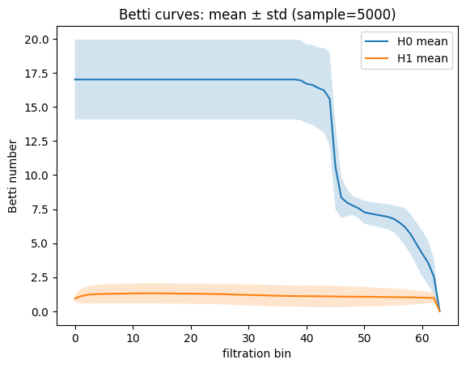
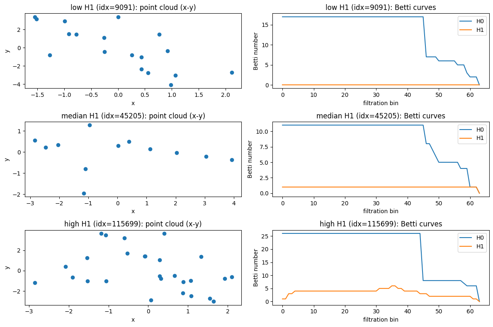
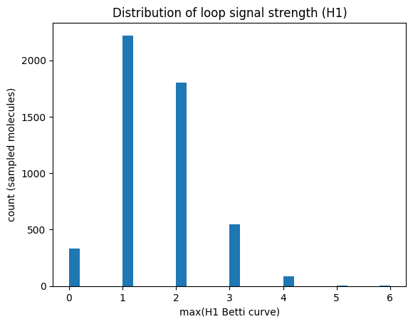

# Topology-Aware Equivariant Neural Networks for Molecular Property Prediction (HOMO–LUMO Gap)

## Abstract
This project investigates how **geometric deep learning** and **topological data analysis (TDA)** can be combined to improve molecular property prediction. We focus on predicting the **HOMO–LUMO gap** on the QM9 dataset using an **E(n)-Equivariant Graph Neural Network (EGNN)** as a baseline and a **topology-aware EGNN** augmented with **persistent homology features** fused via **FiLM conditioning**.

Key findings:

1. Topological features slightly improve predictive accuracy.
2. They significantly improve robustness to coordinate noise.
3. Dataset-level analysis confirms the presence of nontrivial topological variation.

---

## 1. Motivation

Molecules are inherently **geometric objects**: atoms exist in three-dimensional space, and physical properties must be invariant under:

- translations,
- rotations,
- reflections.

Standard neural networks do not encode these symmetries explicitly, which leads to inefficient learning and poor generalization.

**Geometric Deep Learning** addresses this by designing models that respect underlying symmetries. However, geometry alone does not fully capture **global structural properties** such as:

- rings,
- loops,
- multi-scale connectivity.

These properties are naturally described by **topology**.

This project explores whether **topological descriptors** extracted via persistent homology can complement equivariant neural networks.

---

## 2. Mathematical Background

### 2.1 Euclidean Symmetry

The Euclidean group in three dimensions is:

$E(3) = \mathbb{R}^3 \rtimes SO(3)$

A physically valid molecular predictor must satisfy:

$f(\{x_i\}) = f(\{R x_i + t\})$

for all rotations $R \in SO(3)$ and translations $t \in \mathbb{R}^3$.

---

### 2.2 Equivariance vs Invariance

- **Equivariance**: internal representations transform predictably under symmetry.
- **Invariance**: final outputs remain unchanged.

EGNN ensures equivariance at each layer and invariance after global pooling.

---

## 3. E(n)-Equivariant Graph Neural Networks (EGNN)

Each molecule is modeled as a fully connected graph:

- nodes: atoms,
- edges: pairwise interactions.

At layer $\ell$, the EGNN performs the following updates:

$m_{ij} = \phi_m(h_i, h_j, \|x_i - x_j\|^2)$

$h_i^{(\ell+1)} = \phi_h\left(h_i, \sum_j m_{ij}\right)$

$x_i^{(\ell+1)} = x_i + \sum_j (x_i - x_j)\,\phi_x(m_{ij})$

These updates preserve $E(3)$-equivariance.

A graph-level embedding is obtained via masked mean pooling.

---

## 4. Topological Data Analysis

### 4.1 Persistent Homology

Given atomic coordinates as a point cloud:

$X = \{x_1, \dots, x_N\} \subset \mathbb{R}^3$

We build a **Vietoris–Rips filtration** and track:

- $H_0$: connected components,
- $H_1$: loops.

Each topological feature has a birth–death pair $(b, d)$.

---

### 4.2 Topological Features Used

We summarize persistence diagrams using:

- **Betti curves** (64 bins per homology dimension),
- **Persistence entropy**.

Total TDA feature dimension: **130**.

---

## 5. Dataset-Level Topological Analysis

### Mean Betti curves across 5000 molecules


**Interpretation**

The $H_0$ curve:

- Starts around $\sim 17$ components, corresponding to individual atoms.
- Decreases as the filtration connects nearby atoms.
- Reflects molecular size and spatial density.

The $H_1$ curve:

- Has a mean value around $1$–$2$ across filtration scales.
- Indicates the presence of loop-like geometric structures.

This confirms that the dataset contains **meaningful topological variation**.

---

### Examples: low, medium, and high $H_1$ molecules


**Interpretation**

Low $H_1$:
- Tree-like or chain-like geometry.
- No loop structures.

Median $H_1$:
- Partial geometric closure.
- Short-lived loops.

High $H_1$:
- Dense or cyclic structures.
- Strong loop signals in Betti curves.

This demonstrates how TDA captures **global molecular structure** beyond local geometry.

---

### Distribution of $H_1$ strength


**Interpretation**

- Most molecules have $H_1$ values between $1$ and $3$.
- Only a small fraction have zero loop signal.
- Some molecules exhibit strong topological complexity.

Dataset statistics:

- $93.6\%$ of sampled molecules had nonzero $H_1$ signal.

This verifies that the TDA features are **non-degenerate**.

---

## 6. Fusion Model: EGNN + TDA (FiLM)

Let:

- $h \in \mathbb{R}^d$ be the EGNN graph embedding,
- $t \in \mathbb{R}^{d_t}$ be the TDA feature vector.

FiLM conditioning is defined as:

$(\gamma, \beta) = \mathrm{MLP}(t)$

$h' = (1 + \gamma) \odot h + \beta$

This allows topology to **modulate** the geometric representation.

---

## 7. Dataset and Target

Dataset: **QM9** (~130k molecules)  
Target: **HOMO–LUMO gap**  
Metric: **Mean Absolute Error (MAE)**

---

## What is the HOMO–LUMO Gap?

The HOMO–LUMO gap is defined as:

$\Delta E = E_{\mathrm{LUMO}} - E_{\mathrm{HOMO}}$

It represents the minimum energy required to excite an electron and determines:

- chemical reactivity,
- optical absorption,
- electronic behavior.

Small gap → reactive molecule  
Large gap → stable molecule

---

## 8. Training Dynamics


**Interpretation**

- Training loss decreases smoothly.
- Optimization is stable.
- FiLM conditioning does not destabilize training.

---


**Interpretation**

- Training and validation MAE decrease together.
- No significant overfitting.
- Topology acts as a mild regularizer.

---

## 9. Results

| Model | Val MAE | Test MAE |
|------|--------|---------|
| EGNN | 0.2056 | 0.2051 |
| **EGNN + TDA (FiLM)** | **0.2009** | **0.2023** |

**Analysis**

- Approximately $1.4\%$ improvement in test MAE.
- Improvement is modest because QM9 molecules are small and topologically simple.
- EGNN already captures most local geometric structure.

---

## Robustness to Coordinate Noise


At noise level $\sigma = 0.10$:

| Model | Test MAE |
|------|----------|
| EGNN | 0.3904 |
| EGNN + TDA | **0.3014** |

This corresponds to an approximately **23% reduction in error**.

Explanation:

- EGNN relies heavily on precise geometry.
- TDA features are stable under perturbations.
- Topology provides a noise-resistant global descriptor.

---

## 10. Main Conclusions

1. Geometry is essential for molecular prediction.
2. Topology provides complementary global structural information.
3. TDA features are nontrivial across the QM9 dataset.
4. Topology improves robustness to coordinate noise.
5. FiLM is an effective fusion mechanism for geometry–topology integration.

---

## 11. Limitations

- QM9 molecules are small and often topologically simple.
- Improvements in accuracy are therefore modest.
- More complex datasets (e.g., drug-like molecules or proteins) may benefit more from TDA.

---

## 12. Future Work

Potential extensions:

- Element-aware filtrations.
- Bond-weighted simplicial complexes.
- Learnable topological layers.
- Application to larger molecular datasets.

---

## Reproducibility

```bash
python -m src.train
python -m scripts.build_tda_cache
python -m src.train_fusion
python -m src.eval
```
