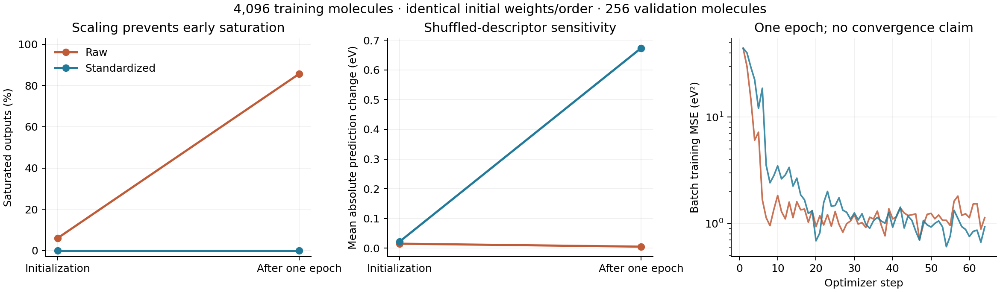

# Training diagnostic — 13 September 2026

**Training standardization prevented early FiLM saturation in this controlled
one-epoch experiment.** Raw and standardized TDA arms started from identical
weights and received the same minibatches. This supports standardization for the
next replication; it does not establish a topology-specific accuracy advantage.



## Frozen experiment

The first 4,096 training IDs and first 256 validation IDs from the original
seed-42 split were selected without outcomes. The scaler uses population means
and standard deviations from **these 4,096 training molecules only**, computed
in float64 and applied before conversion to float32; scales below 1e-6 become 1.
Validation data were not used to fit preprocessing. No new test evaluation was
performed. A full-data replication must refit scaling on its full training split.

The unchanged 130-feature legacy descriptor uses adaptive per-molecule Betti
grids and unit-diameter normalization. Both arms use the default fusion model,
seed 42, batch size 64, AdamW (learning rate 0.001, weight decay 0.01), MSE loss,
one epoch (64 optimizer steps), float32 and TF32 disabled. A shared initial state
and precomputed training permutation isolate the preprocessing change. These are
newly initialized models, not fine-tuned historical checkpoints.

Membership, order, source/package/dataset identities and configuration were
written before feature extraction and evaluation. Exact features and scaler
arrays, per-molecule predictions, step losses and FiLM gradient norms are
[archived](../results/conditioning_diagnostic_2026-09-13).

## Results

| Diagnostic | Raw TDA: initial → after epoch | Standardized TDA: initial → after epoch |
| --- | ---: | ---: |
| Saturated FiLM outputs, absolute tanh > 0.9999 | 5.956% → 85.710% | 0% → 0% |
| Median absolute pre-tanh activation | 1.5943 → 8.4176 | 0.1038 → 0.1732 |
| Mean channel range across validation molecules | 0.3964 → 0.0120 | 0.9965 → 1.2127 |
| Mean absolute prediction change after shuffling descriptors, eV | 0.01508 → 0.00518 | 0.02194 → 0.67330 |
| Clean validation MAE, eV | 6.57388 → 0.91701 | 6.58912 → 0.74172 |

All losses, gradients and predictions were finite. Minimum FiLM gradient norms
were 0.1514 (raw) and 0.6453 (standardized). Rigid coordinate transformation,
atom permutation and extra masked padding changed predictions by at most
9.54e-7 eV, below the 2e-5 eV execution tolerance.

The standardized arm passed the operational gate: saturation below the declared
95% warning level and shuffled-descriptor sensitivity above numerical noise
(the executable uses mean absolute change > 1e-5 eV). That sensitivity only
shows a functioning conditioning path. It could reflect redundant molecular
size/geometry information or unhelpful dependence; it is not proof that topology
improves prediction. No confidence interval or seed-stability claim is warranted
from this single training seed.

The raw arm's rapid movement toward saturation and standardized arm's different
trajectory support a feature-scaling mechanism **in this new experiment**.
They do not reconstruct the historical model's learning trajectory or prove
that scaling was its sole cause. The raw arm has not crossed 95% after this one
epoch; it must not be described as already reproducing complete saturation.

## Compute and decision

Execution used the local **RTX 3080 Ti**, with no Colab runtime allocated.
Training took 1.878 seconds for raw features and 1.768 seconds for standardized
features; the full diagnostic took 19.25 seconds, including 14.57 seconds of
loading, feature extraction/cache access and preprocessing. Peak allocated CUDA
memory was 1.436 GB. Training timings include forward/backward/optimizer work
on batches materialized on the GPU, but exclude validation and batch assembly;
they are not end-to-end full-epoch forecasts.

The decision is to retain training-only standardization and the existing
descriptor definition for the proposed four-arm replication: EGNN, standardized
TDA fusion, simple-geometry fusion and a trained constant-conditioning control.
No smaller-output initialization or shared-grid redesign was needed for this
gate. The [replication protocol](../docs/controlled_replication.md) remains the
next experiment; its multi-seed results are **not yet available**. In particular,
the one-epoch MAE difference is not a basis for a performance claim or for
selecting a winner.

## Reproduction and artifacts

```bash
python -m scripts.diagnose_conditioning --data data/qm9/processed/data_v3.pt --split artifacts/recovered/split42.json --cache artifacts/validation_cache/full-clean --out outputs/conditioning-diagnostic-new
python -m scripts.plot_conditioning_diagnostic --results results/conditioning_diagnostic_2026-09-13
python -m pytest -q
```

Output directories must be new. The public `complete.json` inventories the
original execution, including two checkpoint hashes. Those checkpoints remain
outside Git in `outputs/conditioning-diagnostic-2026-09-13`; they include scaler
arrays and bindings to the manifest/input hashes. `archive.json` inventories the
files actually published, plus the separately generated figure. Original
checkpoints and historical result blobs remain unchanged.
