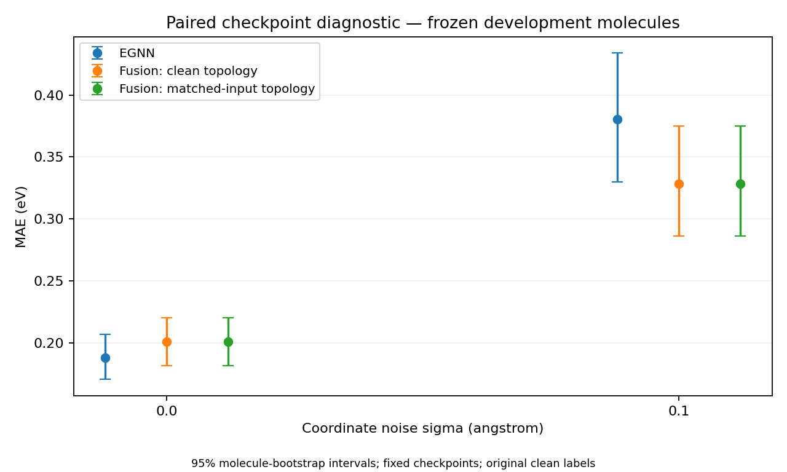

# Paired checkpoint validation — 13 September 2026

The corrected pilot retains a lower noisy-input MAE for the fusion checkpoint,
but does **not** demonstrate a benefit from molecule-specific topology. Its FiLM
activations are saturated: replacing each molecule's descriptor with another real
descriptor barely changes predictions. The decision for this cycle is to correct
the interpretation and stop expansion of the current topology claim. No new
training run was used to obtain a favorable result.

Subsequent work: the separately archived
[one-epoch training diagnostic](conditioning_diagnostic_2026-09-13.md) passed
the conditioning gate using training-standardized features. It does not alter
the historical checkpoint findings below or establish a topology advantage.

## Paired result

The first 256 validation IDs from the original seed-42 split were fixed before
model evaluation. Both checkpoints received identical, unpadded perturbations at
sigma 0 and 0.10 Å, noise seed 20260913. Labels remain the original HOMO–LUMO gaps
in eV. The legacy descriptor definition, including unit-diameter normalization and
per-molecule Betti fitting, was retained.

| Coordinate noise | EGNN MAE | Fusion, clean TDA MAE | Fusion, recomputed TDA MAE | Recomputed fusion − EGNN, 95% CI |
| --- | ---: | ---: | ---: | --- |
| 0 Å | 0.187738 | 0.200843 | 0.200843 | +0.013105 [−0.008091, +0.033155] |
| 0.10 Å | 0.380251 | 0.328248 | 0.328248 | −0.052003 [−0.103444, −0.003422] |



At sigma 0.10, the fusion checkpoint has 13.68% lower MAE in this pilot. Essentially
100% of its **within-pilot paired clean-TDA advantage** remains after topology is
recomputed: the MAE difference between the two fusion conditions is 9.31e-9 eV.
This is not a comparison with the historical 22.8% figure, which used a different
population and different perturbations. The effect of pairing alone has not been
isolated.

Intervals use 4,000 bootstrap resamples of molecules and condition on these two
trained checkpoints and this noise realization. They do not estimate variation
across training seeds, establish convergence, or provide independent confirmation.
The clean pilot point estimate favors EGNN, with a paired interval crossing zero.

The [distribution analysis](../results/paired_pilot_2026-09-13/outcome-analysis.json)
adds context to the means. Fusion has lower absolute error on 117/256 clean
molecules and 139/256 noisy molecules. At sigma 0.10 the median paired difference
is only −0.009290 eV, compared with the mean −0.052003 eV: error magnitudes in
the tails matter. Removing the single pair with the largest absolute error
difference leaves a mean of −0.043418 eV. This is an influence check, not a revised
estimate or an exclusion rule; the primary analysis retains every molecule.

## Why the fusion conditions coincide

The post-pilot sensitivity check kept coordinates and weights fixed. All 256 noisy
descriptors differ from their clean counterparts; the largest feature change is
13. Thus this agreement is not a clean-cache hit masquerading as recomputation.

All 256 × 256 clean FiLM outputs satisfy `abs(tanh) > 0.9999`. Absolute
preactivations range from 6.153 to 130.112, with median 35.139. The maximum range
of a post-tanh channel across molecules is only 9.06e-6. This is consistent with
the conditioning branch behaving almost as a constant on the tested descriptors.

| TDA replacement at sigma 0.10 | MAE, eV | Maximum prediction change from clean TDA, eV |
| --- | ---: | ---: |
| Recomputed from the same noisy coordinates | 0.328248 | 9.54e-7 |
| Shuffled between these molecules | 0.328248 | 9.54e-7 |
| First molecule's real descriptor for every molecule | 0.328248 | 4.77e-7 |
| All zeros | 5.884882 | 9.640992 |

These are reliance stress tests, **not trained-model baselines**. Zero descriptors
are outside the observed input distribution and move FiLM away from its saturated
operating point. Their failure does not establish useful molecule-specific
topology. Conversely, these checks do not show that TDA had no effect during
training, or that the branch is constant everywhere. Different learned geometry
weights and the additional model capacity remain possible explanations for the
checkpoint difference.

There is a direct architectural interpretation. If gamma and beta are constant
on a domain, the first linear layer of the regression head can absorb them:
`W h' + b = W diag(1 + gamma) h + (W beta + b)`. The resulting predictor depends
on the learned geometric embedding without needing individual descriptors at
inference. This equivalence does not identify it with the baseline checkpoint,
whose encoder/head weights and optimization history differ. Saturation is
observed; whether unscaled features caused it, and when it developed during
training, remain untested hypotheses.

The sensitivity check ran locally in float32 with TF32 disabled. Clean-reference
predictions differ from Colab CPU by at most 5.25e-6 eV across both noise levels;
within-device replacement differences above are computed separately.

## Recovery and validity checks

The recovered processed dataset contains 130,831 molecules, SHA-256
`9c58622125e8768329e0035b59c1d3c7446fac13de64b5ad6610bf07fe0ae9a5`.
Both saved preprocessing records contain the string `None`. Target index 4 uses
the processed PyG energy conversion to eV; the collator applies no further target
transform. The original checkpoint hashes and source-derived configuration are
recorded in the [manifest](../results/paired_pilot_2026-09-13/manifest.json).
Weight-only checkpoints still cannot prove the original software environment.

All 256 staged original cache files passed compatibility checks: Betti counts
match exactly, with the declared 1e-6 entropy tolerance. The old clean evaluator
and the paired sigma-zero evaluator agree in MAE within 4.66e-9 eV on this subset
(declared tolerance 2e-6 eV). Sigma-zero clean/noisy fusion predictions are identical.
Translation, rotation, reflection, atom permutation and padding checks passed on
eight preselected real molecules. Nine software tests passed on Windows and Colab.

Adaptive grids remain deliberate legacy semantics for this reproduction. Concrete
[grid examples](../results/paired_pilot_2026-09-13/recovery/adaptive_grid_examples.json)
record all sampling points for the first three molecules. For example, molecules
17587, 78740 and 11640 have H0 grid maxima 0.283679, 0.250595 and 0.231504 after
diameter normalization; their H1 grids also differ. A shared filtration grid
would change the representation and require new caches and retraining. Empty H1
uses the installed giotto default entropy −1 and zero Betti counts.

The full clean validation and test splits were then reproduced locally, using
batch size 128 (the historical comparison evaluator's default), the same frozen
split and recomputed legacy descriptors. This is retrospective reproduction,
separate from the 256-molecule noise pilot.

| Split | Molecules | EGNN MAE, eV | Fusion MAE, eV | Largest difference from saved MAE, eV |
| --- | ---: | ---: | ---: | ---: |
| Validation | 13,083 | 0.205596878 | 0.200893622 | 4.20e-9 |
| Test | 13,084 | 0.205111109 | 0.202297720 | 7.22e-9 |

The [full-clean check](../results/paired_pilot_2026-09-13/full-clean-reproduction.json)
verifies underlying prediction/input checksums, recomputes MAEs and compares all
four metrics with the untouched historical JSON (tolerance 2e-6 eV). Complete
local records are in `outputs/full-clean-val` and `outputs/full-clean-test`;
their hashes are included in the published check.

The full-test paired clean difference is −0.002813 eV, with the existing 95%
molecule-bootstrap interval [−0.005871, +0.000230] eV crossing zero. The validation
interval is [−0.007719, −0.001647] eV, but validation was used for checkpoint
selection and cannot supply independent confirmation. Successful numerical
reproduction establishes that the saved scores can be recovered; it does not
establish training-seed stability or a topology-specific effect.

## Compute and decision

The Colab CPU pilot took 54.69 seconds: 13.27 seconds for descriptors/input/cache
work and 35.23 seconds for three-arm inference; the remainder includes loading,
serialization, statistics and plotting. Artifact recovery checks took 8.75 seconds,
and the old-clean comparison took 23.06 seconds. A large Drive directory initially
timed out; retrying the same files and staging them locally resolved access without
changing the selection. Staging, setup, transfer and authentication waits are not
part of the pilot throughput.

The Colab session used CPU with 12.67 GB RAM and no GPU. The final accounting
snapshot covered 27.75 minutes after setup began, including waits and transfers.
At the UI's approximate 0.08 units/hour rate this is about 0.037 compute units,
not an exact billing measurement. The runtime was shut down after persistent
exports were verified; subsequent work ran locally.

On the RTX 3080 Ti, a real batch of 64 molecules padded to 25 atoms took median
20.47 ms per EGNN optimizer step and 20.39 ms per fusion step, with about 1.09 GB
peak allocated VRAM. Each model had two warmup and five measured disposable AdamW
steps; no updated weights were saved. This is a fixed-batch throughput benchmark,
not a measured epoch. Applying it to 1,636 steps/epoch, ten epochs and both models
gives about 11.1 minutes per seed, or 33.4 minutes for three seeds, **excluding**
topology extraction, I/O, validation, checkpointing, batch-shape variation and tuning.

The full clean validation/test evaluations actually took 129.82 and 124.98 seconds
locally. Together they processed 26,167 molecules, with 221.64 seconds spent on
descriptor/input/cache work and 22.62 seconds on three-arm GPU inference. A linear
extrapolation of that descriptor/input work to all 130,831 molecules is about
18.5 minutes on this local setup; it is not an isolated persistence-kernel timing
or a measured full training-cache build.

The next scientifically useful training experiment would address conditioning
scale/saturation and include a model of matched capacity using simple atom-count
and distance features. Training-only feature scaling, independent training seeds
on the frozen split and monitoring FiLM activations should precede any renewed
topology claim. Changing the Betti grid at the same time would confound that check.
There is no justification here for a larger architecture or dataset. This cycle
stops with a corrected checkpoint diagnostic; it does not launch that replication.

The [proposed follow-up protocol](../docs/controlled_replication.md) makes the next
step concrete: a bounded raw-versus-standardized conditioning diagnostic, then
EGNN, TDA, simple-geometry and trained constant-conditioning controls if the
diagnostic passes. It fixes split/seeds and keeps grid redesign separate.

## Reproduction

Install the [validation environment](../requirements-validation.txt), with the
appropriate official PyTorch 2.10.0 CPU/CUDA wheel. The
[Colab template](../notebooks/paired_validation.ipynb) stages the same original
cache subset, runs recovery, the pilot and the old-clean comparison. It pins the
published implementation used for this pilot. Dataset and original checkpoint
files remain external to Git.

```bash
python -m scripts.prepare_paired --original-root ORIGINAL --legacy-cache-dir STAGED --out RECOVERY
python -m src.eval_paired --data ORIGINAL/data/qm9/processed/data_v3.pt --provenance RECOVERY/provenance.json --split-manifest RECOVERY/split42.json --cache NEW_CACHE --out NEW_PILOT --device cpu --compute-environment colab
python -m scripts.reproduce_clean_subset --pilot NEW_PILOT --original-root ORIGINAL --legacy-cache-dir STAGED --out clean-check.json --device cpu
python -m scripts.check_topology_reliance --pilot results/paired_pilot_2026-09-13 --out reliance-check.json
python -m scripts.benchmark_paired_inputs --pilot results/paired_pilot_2026-09-13 --out throughput-check.json
python -m src.eval_paired --data DATA --provenance LOCAL_PROVENANCE --split-manifest SPLIT42 --cache FULL_CLEAN_CACHE --out full-clean-val --split val --size 0 --sigmas 0 --batch-size 128 --device cuda
python -m src.eval_paired --data DATA --provenance LOCAL_PROVENANCE --split-manifest SPLIT42 --cache FULL_CLEAN_CACHE --out full-clean-test --split test --size 0 --sigmas 0 --batch-size 128 --device cuda
python -m scripts.summarize_clean_reproduction --validation full-clean-val --test full-clean-test --out full-clean-check.json
python -m scripts.analyze_checkpoint_outcomes --full-val full-clean-val --full-test full-clean-test --out outcome-check.json
```

All output locations must be new. The checked-in
[predictions](../results/paired_pilot_2026-09-13/predictions.csv),
[exact inputs](../results/paired_pilot_2026-09-13/inputs.npz),
[summary](../results/paired_pilot_2026-09-13/summary.json),
[reliance checks](../results/paired_pilot_2026-09-13/topology-reliance.json), and
[timings](../results/paired_pilot_2026-09-13/throughput-rtx3080ti.json) allow the
small diagnostic to be inspected without downloading the entire dataset. Original
result JSONs, CSVs and figures are unchanged.
