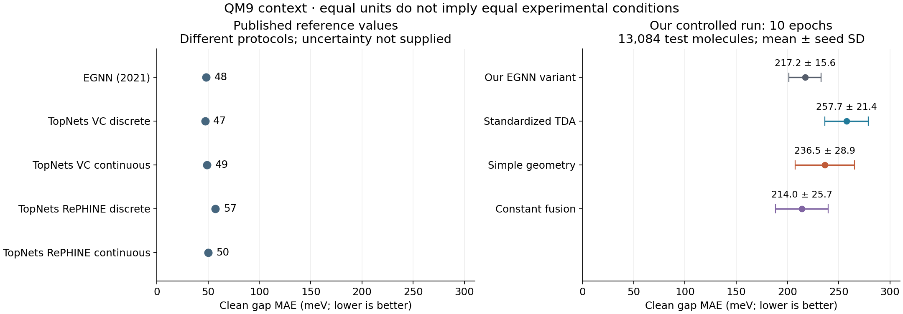
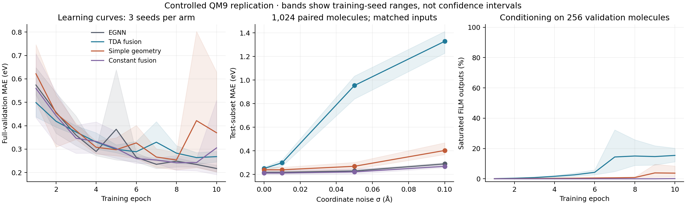
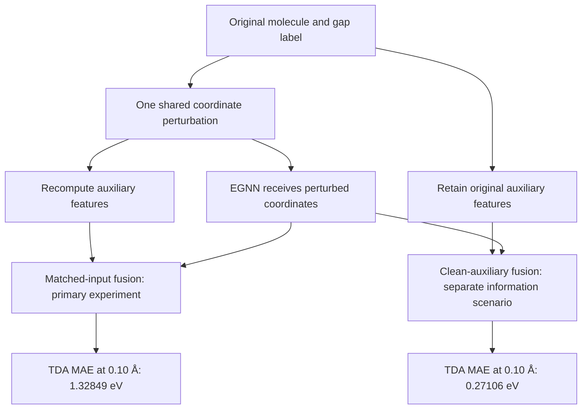
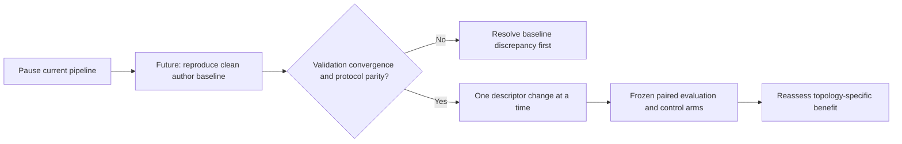

# Research synthesis and pause decision

13 September 2026 · QM9 HOMO–LUMO gap · targeted primary-source comparison

**Pause the current pipeline.** The completed experiment provides a useful,
reproducible negative result: standardized legacy topology features did not help
under the tested budget, and recomputing them after coordinate corruption sharply
worsened predictions. The literature review identifies a more fundamental next
step—establishing a stronger, faithful clean EGNN baseline—before investing in
another topology model. No additional training was performed for this review.

This is a completed internal research milestone, not a competitive QM9 benchmark
or a general conclusion against persistent homology. “Replication” elsewhere in
this repository means repeating our controlled experiment across seeds; it does
not mean reproducing the original EGNN paper.

## Results at a glance

The panels share units and axis limits, but **not experimental protocols**.
Published points have no uncertainty bars because the cited tables do not supply
them for these entries. Our bars are sample SD across three training seeds.
The plot is generated from [source-linked reference data](../results/research_synthesis_2026-09-13/references.json)
and the unchanged [evaluation archive](../results/controlled_replication_2026-09-13/evaluation/summary.json).

| Our model | Full clean MAE, meV | Matched noise σ = 0.10 Å, meV |
| --- | ---: | ---: |
| EGNN variant | 217.18 ± 15.58 | 289.73 ± 10.62 |
| Standardized TDA fusion | 257.69 ± 21.36 | 1328.49 ± 93.82 |
| Simple-geometry fusion | 236.48 ± 28.92 | 403.24 ± 56.50 |
| Trained constant fusion | 214.02 ± 25.72 | 268.58 ± 12.34 |

Clean: 13,084 test molecules. Noise: 1,024 frozen test molecules, three matched
draws, original labels retained. Entries average model MAEs, not predictions.
TDA loses against every control in every seed. The frozen criterion required at
least 1% improvement over each control at σ = 0.10 Å and improvement in all seeds.
It failed. See the [complete experimental report](controlled_replication_2026-09-13.md)
for paired intervals, learning curves, selection rules and integrity checks.

## What similar works actually establish

| Primary work | Relevant result or design | Relationship to this project |
| --- | --- | --- |
| [Satorras, Hoogeboom & Welling, EGNN (2021), §5.3 and Table 3](https://proceedings.mlr.press/v139/satorras21a/satorras21a.pdf) | QM9 gap MAE **48 meV**; seven layers, learned soft edges, sum readout, invariant coordinate treatment; approximately 100k/18k/13k split | Closest baseline reference, but our implementation and training protocol differ |
| [Verma, Souza & Garg, TopNets (2024), Table 4 and Appendix B.2](https://arxiv.org/pdf/2406.03164) | E-TopNets gap MAEs: VC discrete **47**, continuous **49**; RePHINE discrete **57**, continuous **50 meV**; reproduced IMPSN **51 meV** | Equivariant simplicial message passing plus persistence aggregation; not our global Betti-vector FiLM |
| [Demir & Kiziltan, Multiparameter Persistent Homology for Molecular Property Prediction (2023)](https://arxiv.org/pdf/2311.10808) | ToDD combines chemical filtrations with boosted trees; evaluates Lipophilicity, FreeSolv and ESOL using RMSE | Supports considering chemical information in descriptors; different tasks and metric prevent a numeric QM9 comparison |
| [Adams et al., Persistence Images (2017)](https://jmlr.org/papers/v18/16-337.html) | Finite vector representation with a stability result under stated assumptions | Candidate representation for a future ablation; no guarantee of improved gap prediction |
| [Dłotko & Gurnari, Euler characteristic curves and profiles (2023), Proposition 3.1](https://arxiv.org/pdf/2212.01666) | Continuous Betti curves satisfy an L1 bound by twice diagram 1-Wasserstein distance | Prevents interpreting our empirical failure as proof that all Betti curves are unstable |

The TopNets variants span both sides of their reproduced IMPSN baseline on gap
prediction. Topology is therefore not a uniform improvement even within this
small published comparison. We found no directly comparable clean-label,
matched-coordinate-corruption experiment in the reviewed QM9 sections of EGNN
and TopNets. Their clean scores cannot establish a robustness ranking against
our noisy scores. This is a focused comparison, not an exhaustive leaderboard.

## Why our baseline is not a paper reproduction

The published EGNN reference and our baseline differ in more than training
duration. Released-code settings below are pinned to commit
`e9ca6c0c3e1d30a7598efbd66034121b4af8dccc`:
[training script](https://github.com/vgsatorras/egnn/blob/e9ca6c0c3e1d30a7598efbd66034121b4af8dccc/main_qm9.py)
and [model implementation](https://github.com/vgsatorras/egnn/blob/e9ca6c0c3e1d30a7598efbd66034121b4af8dccc/qm9/models.py).

| Setting | Original paper / released implementation | Our controlled run |
| --- | --- | --- |
| Encoder depth / width | 7 / 128 | 4 / 128 |
| Graph readout | Sum, with learned transformations | Masked mean, scalar head |
| Coordinates and edges | Invariant QM9 version; learned soft edges | Coordinate updates enabled; no soft-edge gate |
| Atom input | One-hot and charge-derived features in released code | Learned atomic-number embedding |
| Target / objective | Mean/MAD-normalized target, L1 in released code | Raw eV target, MSE |
| Optimizer / schedule | Adam, cosine schedule in released code | AdamW, fixed learning rate |
| Epochs / batch | Released defaults: 1000 / 96 | Executed: 10 / 64 |
| Split | Paper: approximately 100k / 18k / 13k | 104,664 / 13,083 / 13,084 |

The released default is not evidence of the exact budget of every published run.
Our 217.18 meV is about 4.52 times the 48 meV reference, a descriptive difference
across protocols. We cannot attribute that difference to any single setting or
predict that longer training alone would close it. Equal budgets make our four
arms internally useful; they do not establish convergence or benchmark parity.

## What the noise experiment means

Both scenarios are retained, as requested. Clean auxiliary features supply
information from the original geometry that the baseline does not receive.
Their lower error does not demonstrate robustness of a descriptor recomputed
from a noisy measurement. These are input-measurement experiments: no quantum
labels were recalculated for perturbed structures, so they do not measure
accuracy on new physical conformations.

The earlier raw-feature checkpoint was nearly insensitive to descriptor swaps.
The new standardized models are sensitive but fragile. These are different
trained models, not a same-weight counterfactual. At σ = 0.10 Å, the feature audit
found TDA changes around one training standard deviation in average per-molecule
RMS, yet only about 0.30% of entries exceeded univariate training ranges.
Simple “out-of-range features” is not a sufficient explanation. Optimization
spikes also occurred. Adaptive sampling, unit-diameter normalization, scaling
and learned sensitivity have not been isolated by separate ablations.

The continuous-curve stability theorem concerns an integrated curve distance.
It does not directly bound our molecule-dependent sampled vector or the output
of FiLM and its predictor. This is our interpretation of the mismatch between
the theorem's objects and this implementation; we have not proved an end-to-end
bound. Changing to persistence images would likewise require empirical checks.

## Pause now; restart only with a new baseline milestone

The useful deliverable is the audit trail: correction of asymmetric noise,
diagnosis of saturated conditioning, controlled training, exact paired inputs,
and a bounded negative result. Another arbitrary extension of these twelve runs
would not resolve the differences from the published baseline or identify the
source of feature fragility. The current evidence supports parking this version.

If resumed, first pin the author implementation, split, preprocessing, objective
and selection rule; document any unavoidable differences. Set a compute cap and
validation-based stopping rule before running. Do not use this already inspected
test set to choose hyperparameters. A fresh prospectively frozen evaluation is
needed for stronger confirmatory claims, with prior test exposure disclosed.

Only after that baseline milestone should we compare one representation change
at a time: a shared filtration grid or stable vectorization, then chemically
typed features. Keep the constant and simple-geometry controls, matched noise,
clean-auxiliary scenario, multiple training seeds and compute accounting.
These are proposed experiments, not demonstrated fixes.

## Reproducibility and remaining limits

The [archive](../results/controlled_replication_2026-09-13/archive.json) records
hashes for predictions, exact evaluation inputs, scalers and training histories.
The controlled run passed 13 tests; all 335,184 prediction rows were checked,
and 12,288 overlapping zero-noise predictions matched the full-clean evaluation.
Intervals in the experimental report condition on trained models and fixed noise
draws, and do not estimate a population of future training runs.

Large model weights remain outside Git under
`outputs/controlled-replication-2026-09-13/`; repository manifests record their
hashes. The public archive supports reanalysis without training, but exact model
reruns also require those checkpoints and the original dataset. An independent
off-machine backup of the new weights has not been verified in this review.
Do not delete local outputs when parking the project.

No historical numerical result was overwritten for this synthesis. All changes
are presentation, source-linked comparison and interpretation; model code and
the predeclared experimental criterion remain unchanged.
